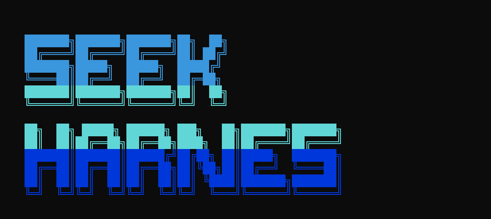

# seekHarness

## 快速开始

```bash
npm install
cp .env.example .env
# 编辑 .env，填入 DEEPSEEK_API_KEY
```

```bash
# 启动动画 + 无限对话 REPL
npm run dev

# 先执行一条任务，再进入对话
npm run dev -- "读取 README.md 并总结"

# 跳过开屏动画
npm run dev -- --no-splash
```

REPL 命令：`/help` `/clear` `/exit`

## 架构

```
src/
  index.ts          # CLI 入口
  agent/loop.ts     # Agentic loop（LLM ↔ 工具 循环）
  llm/client.ts     # DeepSeek（OpenAI 兼容）客户端
  tools/
    registry.ts     # 工具注册表
    read.ts           # 读文件
    edit.ts           # 精确替换编辑
```

## 环境变量

| 变量 | 说明 |
|------|------|
| `DEEPSEEK_API_KEY` | API 密钥（也可用 `OPENAI_API_KEY`） |
| `DEEPSEEK_BASE_URL` | 默认 `https://api.deepseek.com` |
| `DEEPSEEK_MODEL` | 默认 `deepseek-chat` |

## 文档

- [Agent loop](docs/harness01-agentloop.md)
- [Tool system](docs/harness02-toolsystem.md)
- [Eval (SWE-bench)](docs/harness04-eval.md)

## 评测（M1：mini 子集）

端到端跑通 [SWE-bench Lite](https://www.swebench.com/lite.html) 的 5/20 题 mini 子集。完整说明见 [docs/harness04-eval.md](docs/harness04-eval.md)。

```bash
# 一次性准备
pip install swebench==4.1.0 datasets   # 需 Docker 已启动
npm run eval:build -- --size 5        # 生成 datasets/mini.jsonl + mini-instances.json
npm run eval                          # TS 跑 agent，把 patch 写到 outputs/patches/
npm run eval:score                    # Python 调 swebench 跑测，输出 summary.json
```
